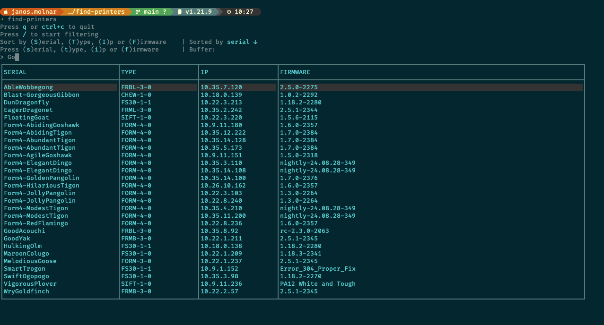

<!-- PROJECT LOGO -->
<br />
<div align="center">
  <a href="https://github.com/othneildrew/Best-README-Template">
    <svg width="31" height="39" viewBox="0 0 31 39" fill="none" xmlns="http://www.w3.org/2000/svg">
    <path d="M0.5 4.09821C0.5 2.24904 2.17893 0.75 4.25 0.75H26.75C28.8211 0.75 30.5 2.24904 30.5 4.09821V24.1875H0.5V4.09821Z" fill="#FF6101"/>
    <path d="M15.5 27H30.5V34.5C30.5 36.5711 28.8211 38.25 26.75 38.25H15.5V27Z" fill="black"/>
    <path d="M0.5 27H15.5V38.25H4.25C2.17893 38.25 0.5 36.5711 0.5 34.5V27Z" fill="#CFCFCF"/>
    <path fill-rule="evenodd" clip-rule="evenodd" d="M0.5 24.1875H30.5V27H0.5V24.1875Z" fill="#7F3001"/>
    <path d="M6.46697 19.2792L9.29959 16.4466C8.55717 15.2892 8.125 13.9144 8.125 12.4375C8.125 8.32987 11.4549 5 15.5625 5C19.6701 5 23 8.32987 23 12.4375C23 16.5451 19.6701 19.875 15.5625 19.875C14.0856 19.875 12.7108 19.4428 11.5534 18.7004L8.7208 21.533C8.09817 22.1557 7.08933 22.1557 6.46697 21.533C5.84461 20.9104 5.84434 19.9018 6.46697 19.2792ZM15.5625 19.3438C19.3766 19.3438 22.4688 16.2516 22.4688 12.4375C22.4688 8.62339 19.3766 5.53125 15.5625 5.53125C11.7484 5.53125 8.65625 8.62339 8.65625 12.4375C8.65625 16.2516 11.7484 19.3438 15.5625 19.3438ZM6.84256 21.1574C7.25747 21.5723 7.9303 21.5723 8.34494 21.1574L11.1082 18.3941C10.5385 17.9675 10.0322 17.461 9.60559 16.8918L6.84256 19.6548C6.42739 20.0694 6.42739 20.7425 6.84256 21.1574Z" fill="white"/>
    <path d="M15.5625 6.0625C19.0834 6.0625 21.9375 8.91664 21.9375 12.4375C21.9375 15.9584 19.0834 18.8125 15.5625 18.8125C12.0416 18.8125 9.1875 15.9584 9.1875 12.4375C9.1875 8.91664 12.0416 6.0625 15.5625 6.0625ZM15.5625 18.2812C18.7898 18.2812 21.4062 15.6648 21.4062 12.4375C21.4062 9.21016 18.7898 6.59375 15.5625 6.59375C12.3352 6.59375 9.71875 9.21016 9.71875 12.4375C9.71875 15.6648 12.3352 18.2812 15.5625 18.2812Z" fill="white"/>
    <path d="M15.5625 7.92188C15.7094 7.92188 15.8281 8.04061 15.8281 8.1875C15.8281 8.33439 15.7094 8.45312 15.5625 8.45312C13.3621 8.45312 11.5781 10.2371 11.5781 12.4375C11.5781 12.5844 11.4594 12.7031 11.3125 12.7031C11.1656 12.7031 11.0469 12.5844 11.0469 12.4375C11.0469 9.94355 13.0685 7.92188 15.5625 7.92188Z" fill="white"/>
    </svg>
  </a>

  <h3 align="center">find-printers</h3>

  <p align="center">
    CLI tool to find Formlabs printer information
    <br />
  </p>
</div>


<!-- TABLE OF CONTENTS -->
<details>
  <summary>Table of Contents</summary>
  <ol>
    <li>
      <a href="#about-the-project">About The Project</a>
    </li>
    <li>
      <a href="#getting-started">Getting Started</a>
      <ul>
        <li>
        <a href="#usage">Usage</a>
        </li>
      </ul>
    </li>
    <li><a href="#development">Development</a></li>
    <li><a href="#project-structure">Project Structure</a></li>
  </ol>
</details>


<!-- ABOUT THE PROJECT -->
## About The Project



`find-printers` is a small TUI / CLI tool build on top of Borg API to query printer information including IP, SerialName, MachineType and Firmware Version. All of this can be quickly copied with shortcuts.


## Getting Started

Since the tool has no knowledge of Borg secrets, it requires to first setup a Borg authentication token. The token can be aquired from Borg UI.

Install `find-printers`:
```
$ go install github.com/FormJani/find-printers@latest
```

Setup the token:
```
$ find-printers set-token <token>
```

Use the tool:
```
$ find-printers
```

### Usage
`find-printers` has some handy shortcuts to filter, sort and copy data

`Q / CTRL + C`  - Quit

`/` - Start searching, typing characters filters the data, its possible to search in all columns. Pressing `Enter` after search allows to sort, or copy from filtered data

`S / T / I / F` - Sort by Column (Serial, Machine Type, IP address, Firmware)

`s / t / i / f` - Copy column in selected row (Serial, Machine Type, IP address, Firmware)

## Development

To locally run the tool the easiest is to use the provided `make` commands
```
make build      - builds the binary
make install    - build the binary and links it to `find-printers` command
make run        - runs the tool locally
```


### Project Structure
```
.
├── Makefile
├── README.md
├── borg/          - package for interacting with Borg API
├── go.mod
├── go.sum
├── images/        - images for this README
├── main.go        - entrypoint
└── ui/            - code for the TUI to display information
```